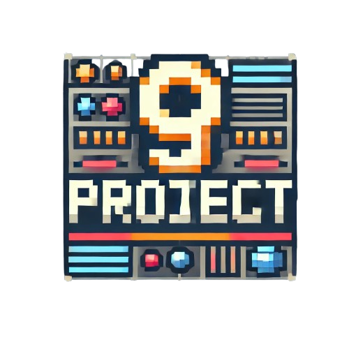
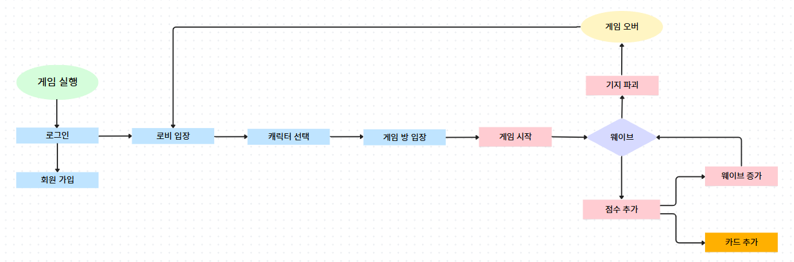

# TowerDefense

## 프로젝트 소개

## 프롤로그

🌅 인류의 편의성을 증진시키기 위해 만들어진 인공지능의 반란이 일어난지 9년…
쉴 틈 없이 몰려오는 인공지능의 물량에 지쳐버린 인류는 점점 밀려나게 되어버리고
어느덧 인류가 살아갈 장소 마저 지하 셸터로 한정되어 졌다.
인류는 마지막 반격을 위해 쌓아온 전투 데이터를 기반으로
**인공지능과 비슷한 시뮬레이터를 만들게 되었고,**
이것을 토대로 영웅 육성을 위한 Project9을 실행한다.
하지만 희망조차 남아있지 않는 인류에겐 지원자가 없는 그 순간…
4명의 용감한 자들이 지원을 하였고,
**그들은 시뮬레이터를 통해 영웅으로서 성장을 하려고 한다!**

## TowerDefense 게임 소개

> 여러 명의 플레이어가 협력하여, 각자의 덱에 있는 다양한 카드들을 사용해 타워를 설치하거나 강화하고, 때로는 직접 적을 공격하여 중앙 기지를 방어하는 게임입니다.
> 타워 디펜스 형식의 게임에 Slay the Spires와 같은 덱빌딩 요소가 추가되어 랜덤성을 부여한 게임이라고 할 수 있습니다.

## 프로젝트의 목표

- **실시간 멀티플레이**
  안정적이고 신뢰성 있는 실시간 데이터 전송을 위해 TCP 소켓 사용
- **서버 주도의 처리방식**
  이번 프로젝트에서는 백엔드 개발을 하는 입장으로 게임 내에서 일어나는 모든 처리를 서버에서 하는 방식으로 만들어, 백엔드 기술로 어디까지 만들 수 있는지 시도해 보겠다는 도전적인 목표가 있음.
- **분산 서버**
  서버가 모든 처리를 하기에 그만큼\*\* 서버의 과부하가 생김을 방지하기 위한 분산 서버.
  Login Server, Lobby Server, Battle Server, Gateway Server를 만들어서 서버를 최적화.

## 서비스 아키텍처

.png?table=block&id=dcad5f01-0988-4bcc-a4b0-8fcfdb8416eb&spaceId=83c75a39-3aba-4ba4-a792-7aefe4b07895&width=1420&userId=&cache=v2>)

## 게임 플로우 차트

1️⃣ 게임의 목표는 정해진 구역 내에서 몰려오는 몬스터로부터 기지를 방어하는 것입니다.

로비에서는 캐릭터를 선택할 수 있으며,
게임이 시작되면 파티를 구성하고 채팅을 하며, 캐릭터의 고유 능력과 다양한 카드를 사용할 수 있습니다.
카드는 타워 카드와 스킬 카드로 나뉘어 있습니다.

2️⃣ 게임은 몬스터가 끊임없이 몰려오는 무한 웨이브 방식입니다.

몬스터는 계속해서 몰려오며, 점수에 따라 웨이브가 증가합니다.
일정 점수를 달성할 때마다 무작위로 카드를 한 장씩 지급받으며, 운 요소가 크게 작용합니다.

3️⃣ 기지의 체력이 0이 되는 순간 게임 오버입니다.

## 주요 콘텐츠

- [게임 플레이 및 UI](https://www.notion.so/teamsparta/UI-6ff71c8be1684e9fa6e45d581bb3f20a?pvs=25&cookie_sync_completed=true)
- [4가지 종류의 캐릭터 및 전용 능력](https://www.notion.so/teamsparta/4-15b669ad3b094b918938f881249bfa94)
- [5가지 종류의 로봇 몬스터](https://www.notion.so/teamsparta/5-32f0dda393ad4b70a31ec0c3270cd96f?pvs=25)
- [확률형 카드획득](https://www.notion.so/teamsparta/3f366a6ffb9e4c3c9e400986383ae3f6?pvs=25)
- [르탄이들의 든든한 버팀목 타워](https://www.notion.so/teamsparta/eab3c8e4c8fc403d96280b48782f7889?pvs=25)

## 시연 영상

- [시연 영상](https://www.notion.so/teamsparta/15f2dc3ef51481418e4dfc620845fb20)

## 트러블 슈팅

- [엄청난 수의 InitialPacket](https://www.notion.so/teamsparta/InitialPacket-bf5c7da28eb74c2394ec6f3259778b23)
- [타워 총알 동기화 문제](https://www.notion.so/teamsparta/427e5cd0a5044efa9943f37444e36805)
- [서버 CPU 부하](https://www.notion.so/teamsparta/CPU-ad6828ca4d03454c92e7eb6f84046a14?pvs=25)
- [서버 확장성 문제](https://www.notion.so/teamsparta/7ab684bdf1184f869c5ef28a6bb5e6b1)

## 기술 스택

- **Backend**
  -     
- **Infra**
  -   
- **Client**
  -  

## 기획

- [기획 문서](https://teamsparta.notion.site/d36b30239d8240199ef0d699181070a6)

## 게임 다운로드

- [클라이언트](https://ssw1113.itch.io/project9)

## 관련 링크

- [팀 노션](https://teamsparta.notion.site/9-2dfa6b2d1f674002821c8e0459caec93)

## 👩‍💻 팀원

| 이름   | 역할                            | email                 | blog                                                                                 |
| ------ | ------------------------------- | --------------------- | ------------------------------------------------------------------------------------ |
| 윤서진 | 팀장,백엔드                     | ydh23203727@gmail.com | [윤서진 블로그](https://velog.io/@yth0417/posts)                                     |
| 김수빈 | 부팀장, 백엔드 개발             | rlatnqls311@gmail.com | [김수빈 블로그](https://velog.io/@sidhd3030/posts)                                   |
| 김형구 | 팀원, 백엔드 개발               | gudrn8293@naver.com   | [김형구 블로그](https://gudrn8293.tistory.com)                                       |
| 신승우 | 팀원, 클라이언트 개발           | ysshin1016@gmail.com  | [신승우 블로그](https://nbcssw.tistory.com/)                                         |
| 조정현 | 팀원, 백엔드 및 클라이언트 개발 | emforhs0913@naver.com | [조정현 블로그](https://cannons.notion.site/13c383dfd6bf814e87acf0f93b5c2c4a?pvs=73) |
| 황의헌 | 팀원, 백엔드 개발               | policessu@naver.com   | [황의헌 블로그](https://velog.io/@mu92204/posts)                                     |

## 프로젝트 제작 기간

2024.11.13 ~ 2024.12.22

## 회의록

- [회의록](https://www.notion.so/teamsparta/640aefdbe069499388cd0b93217c13bc)
